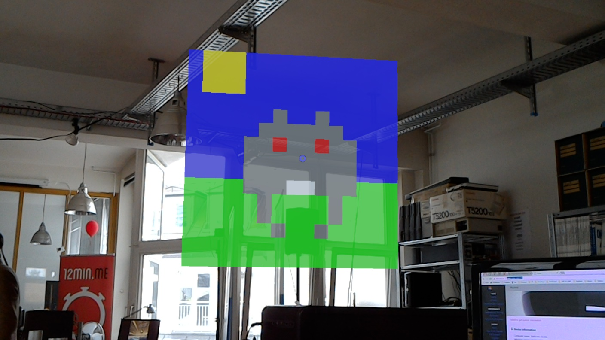

# HoloPixelArt

A small-demo HoloLens app to draw pixel art... It was made in order to learn more about how to architecture HoloLens project in a good and neat way.

There are 5 voice commands to change colors:

- Change to gray
- Change to red
- Change to blue
- Change to green
- Change to yellow

A huge part of the code is reused and based on the awesome work and article of [Joost van Schaik](https://github.com/LocalJoost).

